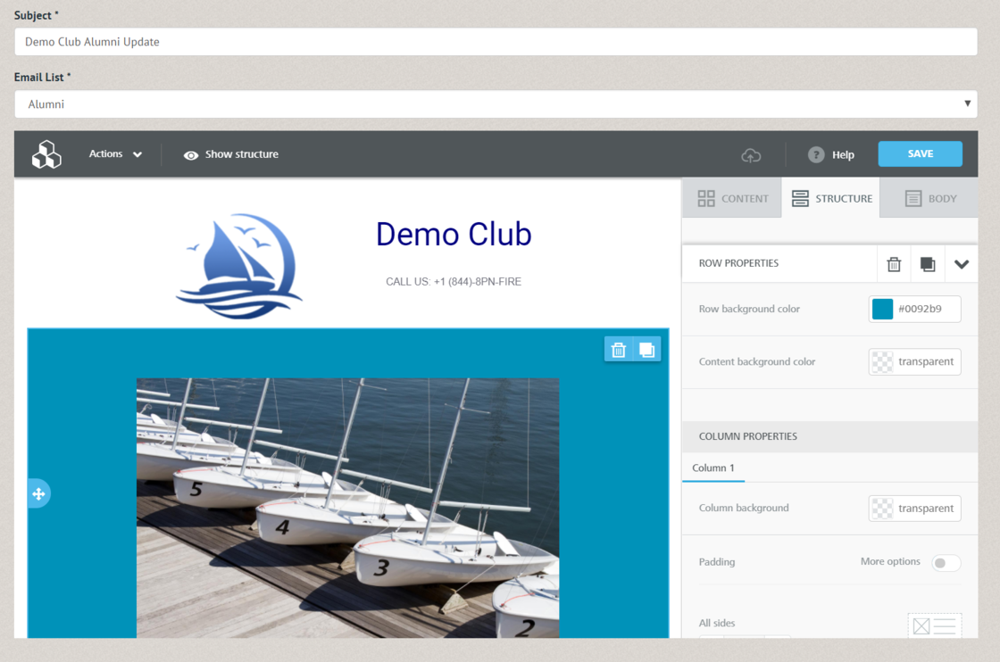

# New Features - Contacts / Members

## Email Campaigns

We've integrated a complete newsletter and email campaign editor directly into Pinfire Club Manager.  Built on top of the same engine as our email lists (meaning they can be completely dynamic based on contact searches), you can now author beautiful email newsletters through our system.  No longer will you need to keep yet another subscription just to send out beautiful newsletters to your members or announcements to your customers.  Easily include pictures, links, logos and more!

# New features - Security

## Audit Log

We now keep track of what everyone does in the system, including Pinfire staff.  If you ever have a problem with an order, or member, you can view the Audit Log under Reports -> Custom Reports to see what everyone has been up to in the system.

## Password Policies and Dormant Permission Groups

We now offer configurable password policies for our university and other large organizations.  By default, we follow the latest NIST guidelines and thus only require that your password is >8 characters and not easily guessable.  That said, we now have the ability to implement alternate guidelines as required by your parent organization, including special login timeouts, varying password complexity requirements, expiration of permission groups after inactivity, account lockout based on IP after some number of failed attempts, and more!  Have complex security requirements?  Contact us and we'd love to work with you to ensure we can meet all of your parent organization's needs!
