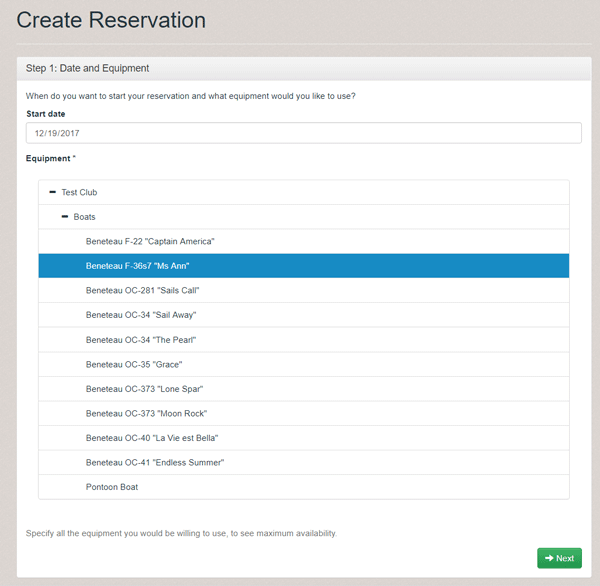
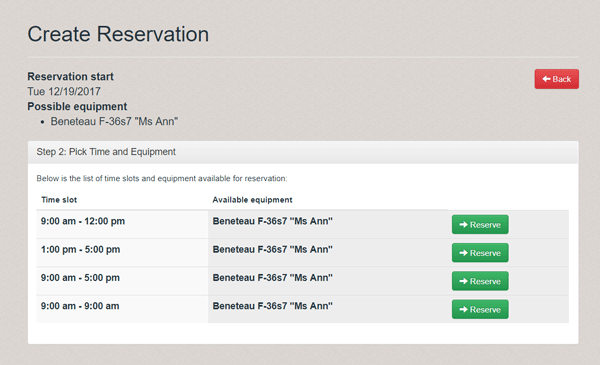
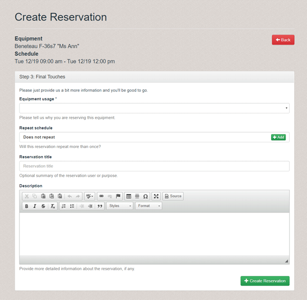
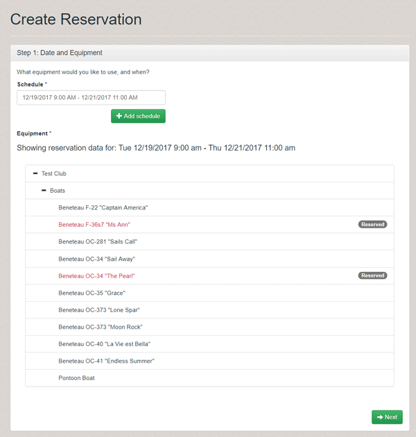
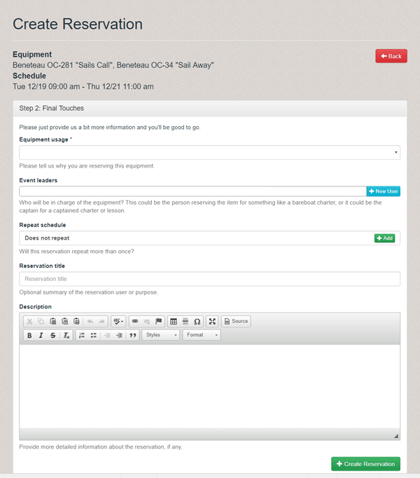

Equipment Reservation Rules allow you to customize the operation of reservations to fit the unique needs of your business.  You can customize the Equipment Reservation module to limit the types and times your customers can reserve equipment.

With reservation rules, you can customize:

* Available reservation time-slots: Optimize your dock/office staff to only have reservations start or end at specific times:
    * For example, only allow reservations between 9am - 12pm and 1pm - 4pm (versus free-form)
	* These can be programmed to change at different dates to coordinate with available sunlight and daylight savings time.
* Available reservation usages: Limit the types of reservations non-admins (or any person without the "administer equipment reservations" permission) can create.
     * For example, only allow normal members to create "Day Sails" and "Overnight Charters", while reserving "Instruction", "Maintenance", etc... for staff to set up.
* Other restrictions
    * We've added template code in our system to add other checks and restrictions on top of the existing Rating and Membership checks.
    * Some examples of restrictions we can now easily add include:
        * Only allow one future reservation on the calendar at a time, ensuring fairness for clubs that might allow unlimited usage.
        * Restrict reservations for the following week to only be made after 9PM on the preceding Thursday, ensuring boats remain availabile for administrative-reservations (e.g. instruction) before that time.

There are now two different ways to create reservations, depending on if time-slot restrictions are activated for the current user (you have us program them into the system) AND the current user is not an Administrator (which causes Reservation Rules to be overridden):

* If time-slot restrictions are enforced for your club and the current Member/User:
    * Step 1 - Pick date and equipment: The customer picks the date they wish to start their reservation and possible boats they wish to use so we can show them availability in time-slots beginning that day.

    * Step 2 - Pick time and equipment: The customer can now see available time-slots for the possible equipment they are willing to use and can choose to reserve it (as seen below):

    * Step 3 - Additional information: Finally, the Customer/Member picks the usage of the equipment they wits to check out and enters an optional repeat schedule, reservation title and description:
	    * If usages are restricted so that only one usage is available for a member, this page can be skipped.
		* Likewise, repeat schedule can be limited to Administrators only, if desired.

    * At this point, their reservation is complete.
 
* If time-slot restrictions are not enforced (because they are disabled, or because the user is an admin), the reservation process is now two steps:
    * Step 1 - Pick schedule and equipment: The administrator picks the start/end dates/times for the reservation, then based on the equipment availability presented, picks an item to reserve:

    * Step 2 - Additional information: The administrator picks the usage, leader/captain, repeat schedule and optionally a title/description:

    * Their reservation is complete.

For the Winter 2017 Release, we have not yet built out a user interface to program reservation rules in the system.  We will be releasing a *survey*, to be send mid-Q1 of 2018 to learn more about how both our current and prospective customers plan to use this feature so we can build out the user interface to cover as many cases as possible.  In the meantime, if you wish to restrict certain usages, restrict time slots or add other restrictions, please email [support@pinfirelabs.com](mailto:support@pinfirelabs.com) and we can add these for you for either no or minimal charge, depending on complexity.

We will also be including questions in our upcoming *survey* about how your organization prices reservations/charters.  These rules are the first step towards releasing our forthcoming "Prepaid Reservations" feature, where you'll be able to acquire payments from customers during booking using either credit card or internal credits.  We want to learn more about how your club/school handle reservation/charter payments to make sure we can accommodate everyone's needs as we release new features.

Please contact us at [support@pinfirelabs.com](mailto:support@pinfirelabs.com) with any questions about these new features.  We look forward to continuing to grow Pinfire Club Manager to help you further optimize your organizations' reservations and other workflows!
