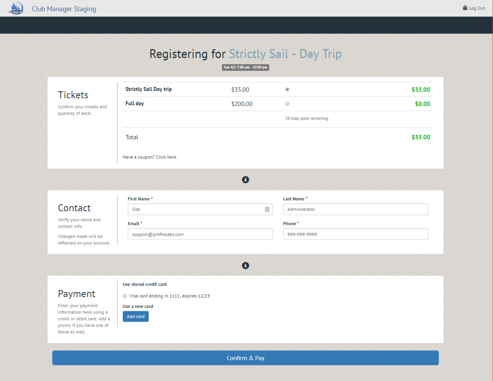
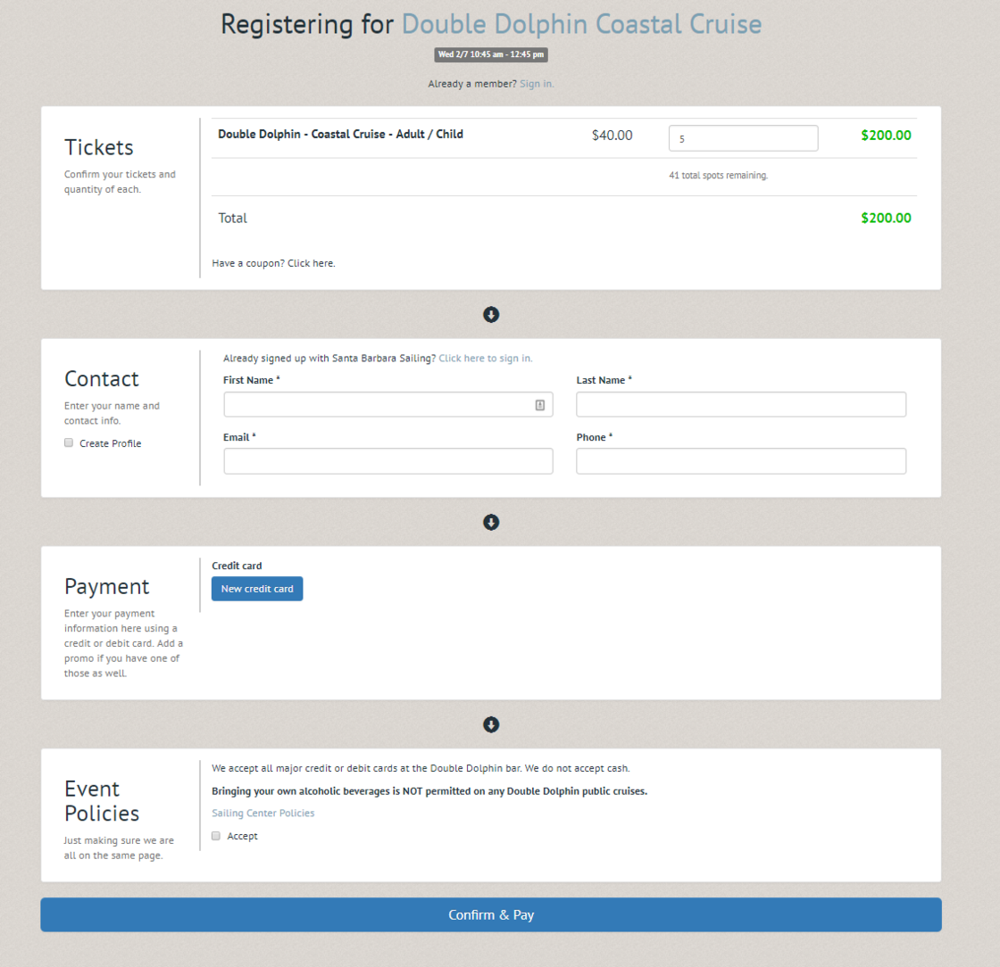
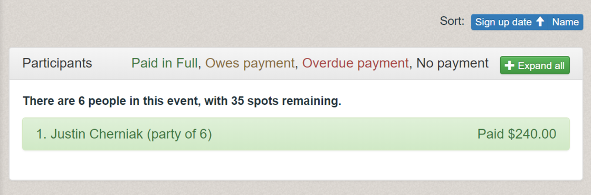

## Simple registration mode

We've created a new way for your customers to register for events.  In addition to our "standard" registration, which requires customers to create a separate account before signing up, we now offer a "simple" registration mode which lets anyone complete registration using a quick, one-page registration.

* Please note that the following features are NOT available when using simple registration:
    * Wait list
    * Multiple payments within a sign-up option (deposit/remainder)

## Guest / quantity support

In addition, we've also added the ability to quickly allow members to register themselves, plus others for events.  Intended for clubs that offer events to the public that aren't skills-intensive, nor require prerequisite ratings (such as whale watching cruises, yoga classes, etc.), this enhancement allows customers to quickly register themselves and friends for an Event. 

_Note: this is NOT intended to be used for youth camp registration, as children should be individually tracked.  Coming next month, we will have support for a third registration mode, "youth" which created "linked accounts", allowing parents to easily register multiple children at once, while still keeping track of each child individually in PCM._
