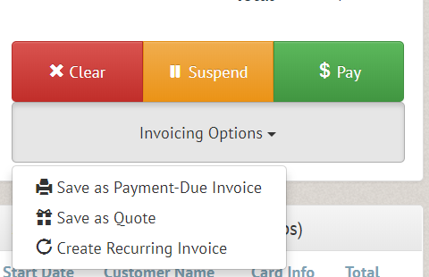
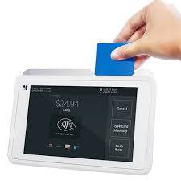
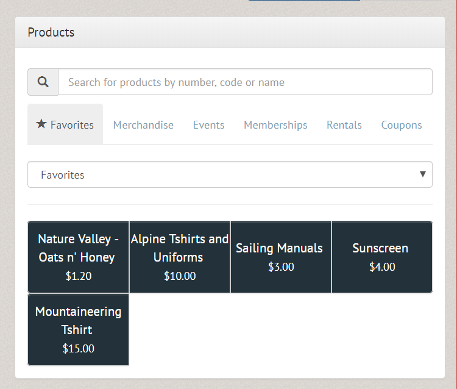
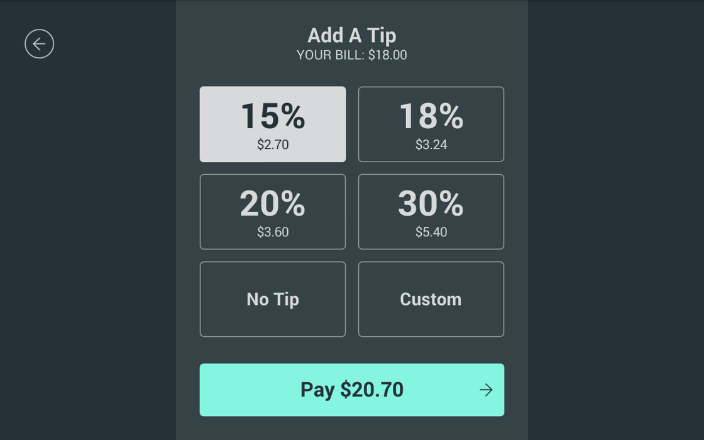

The main theme of our January 2018 update includes is greatly improved financial functions in Pinfire Club Manager (PCM).  We've added an entirely new invoicing engine to help meet all of your club's billing needs.  Other highlights include email campaigns, support for rules within equipment reservation and more!

# New Features - Finances

## New invoicing system
We've built out a brand new invoicing system to help streamline all of your club's billing needs.  You can now create invoices or sales quotes for any item you can sell.  In the POS, you'll notice a new "Invoicing Options" section which lets you create quotes, invoices or create recurring invoices (see below).

* Payment due invoices allow you to send invoices to your customers who can pay at a later date.  An extension of our old "request payment" feature, invoices can be used for any item in the system, not just event payments.  Options for invoices include:
    * Record a manual payment: For use if your club processes with Stripe, Clover or Authorize.Net (we will be adding more payment processor options soon).  You can also charge a card manually from this screen.  You can also record payments made by any offline method including check, cash or non-integrated card reader.
    * Request a payment:  This option generates an email (based on the "request payment for invoice" email template that will include a special link the customer can use to pay the invoice.  They don't need an account to complete checkout.
    * Void:  Cancels the invoice.
    * Print:  Generates a PDF of the invoice that can be printed or emailed.
* Quotes are similar to invoices, but simply prepare and save a price that can be send to customers.  If your club services corporate clients, they will often want a printed quote they can get approval for, before requesting an official invoice.
    * Quotes can be converted to invoices or voided.

*NOTE:* Creating a *Payment Due Invoice* with an event will register the customer in the event*, while a *Quote* does not unless it is converted into an invoice.

## Recurring invoices

We now allow you to create recurring invoices using any payment processor, for any item in the system!  This replaces our previous recurring membership billing that was built on top of Stripe's Subscription API.  This new system gives you the ability to offer recurring billing over a much wider range of payment processors.  Also, his new system gives you much more control over how members are billed, including normalizing of billing dates, custom pricing, pausing billing and more!

In addition, you can also create recurring invoices for items other than memberships such as docking fees, insurance waivers, etc.

## Enhanced coupon support

Our new version of *Pinfire Club Manager (PCM)* supports many different configuration options for Coupons.  You can offer coupons based on a _fixed amount_ or _percentage-off_, restrict coupons to particular groups of people, restrict coupons to only be valid for certain types of items, limit usage by dates or number of uses and more.  Check out the new options in the Coupons tab of the "Administer Items for Sale" option (under the Financial menu).

## Integrated credit card processing

We've integrated with [Clover](https://www.clover.com) to allow you to process credit cards directly through our POS system with or without a standalone reader.  Processing through Clover allows you to get significantly lower "card-present" processing rates, saving you a significant amount of processing fees if you take payments in person.  Contact us to get set up with terminals and save money!  Clover terminals accept EMV chip cards, NFC swipeless payments (Apply Pay, Android Pay) and more!

## Suspended transactions

We now offer an easy way for you to pause "in-progress" transactions in our POS.  Suspended transactions were designed for clubs that run on-boat or on-land bars to keep track of bar tabs, but can also be used for pausing any "in-progress" transaction, such as when you've rung someone up, but they left their credit card in the car.

## Favorites screens in the POS

This new feature allows you to create quick-shortcut screens in the POS system (Administration -> Administer POS Screens) to quickly find your most frequently used items.

## Tipping

You can now accept tips on any item sold through the POS.  If you use Clover, the customer can select a tip amount on screen from preprogrammed percentages or enter their own.  If you are not using Clover, there is a new tip box you can utilize to add tips to any payment.

## Cost of goods tracking

For any merchandise item in the system, you can add a cost and "cost account".  These tie in to the new "Sum of account profit by payment method" Financial Report to see the profits made over a period of time on your merchandise sales.
